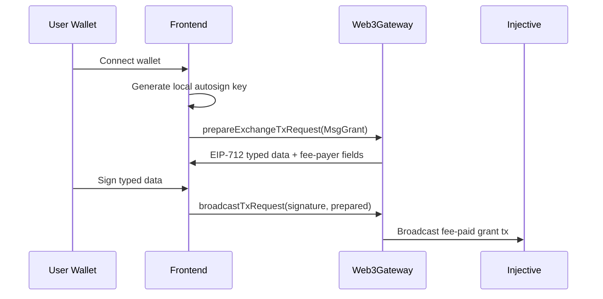
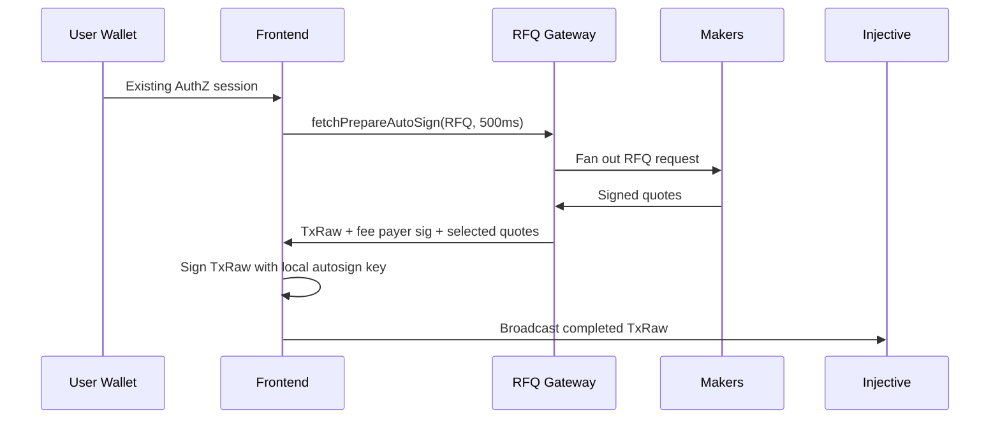
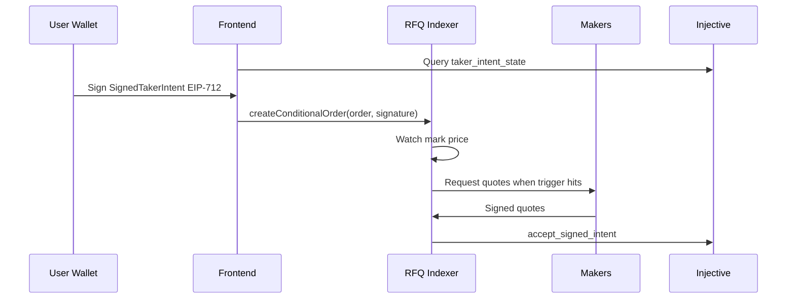

# Architecture

## Components

An RFQ-enabled browser app usually has six local modules:

1. Wallet connection
2. Web3Gateway fee-payer broadcaster for setup transactions
3. AuthZ and local autosign key storage
4. RFQ request builder
5. RFQ gateway settlement broadcaster
6. RFQ conditional TP/SL manager

Only the app's non-secret backend endpoints should run server-side. The user
wallet signs AuthZ and conditional TP/SL intents in the browser. Setup
transactions go through Web3Gateway fee payer. The local autosign key signs RFQ
settlement transactions in the browser.

## AuthZ Setup

This is the path that removes the user's need to hold INJ for setup gas.

## Open Position

## Close Position

Close uses the same settlement path as open:

- opposite direction
- existing position quantity
- `margin: "0"`
- price protection from mark price

The app should also cancel any active conditional TP/SL lane after a
reduce-only close.

## TP/SL

TP/SL is off-chain until triggered:

## State Boundaries

Local browser state:

- connected EVM address
- derived Injective address
- local autosign key, keyed by granter address
- current market metadata cache

Indexer state:

- RFQ request ACKs and quote stream
- active conditional orders
- settlements

Contract state:

- AuthZ grants
- RFQ maker registry
- taker intent `epoch`
- taker intent `lane_version`

Do not derive contract replay counters locally. Query them.
